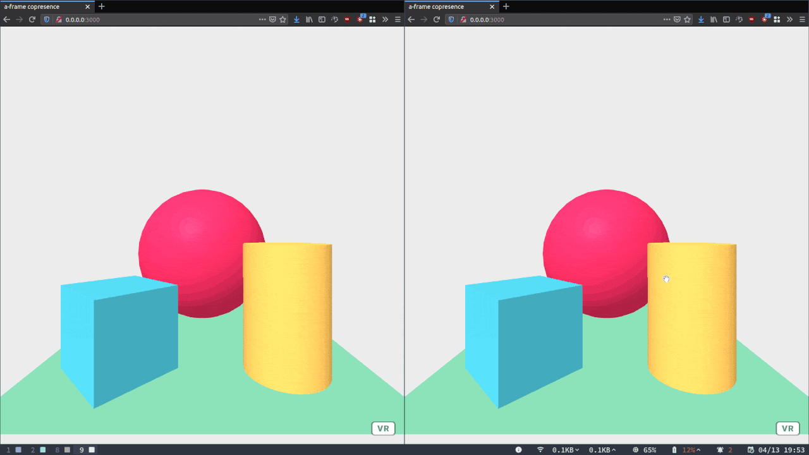

# aframe-copresence

A (minimal, hacky) way to share user positions across `A-Frame` instances, using `socket.io`.

Run `node index.js` to start the server, visit it from multiple browsers to see it work!

